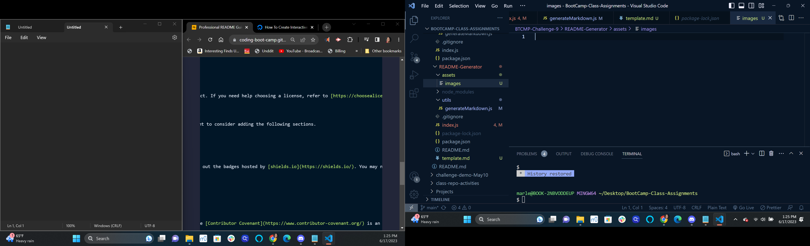

# README generator, 
## Description
It makes a tedious task more streamlined and pleasant!
I learned about creating prompts and writing to files.

## Table of Contents
- [Installation](#installation)
- [Usage](#usage)
- [Credits](#credits)
- [License](#license)

## Installation
In the terminal, type `npm i`

## Usage
In the terminal, type `node index.js` and answer the questions.

    
 
## Credits
n/a
n/a
undefined

## License
License Type 3
